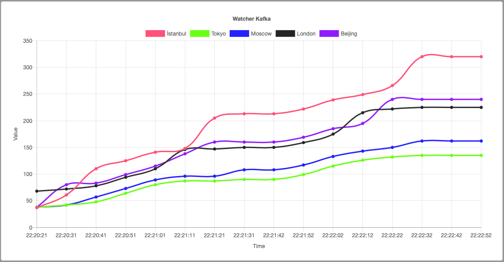

# WatcherKafka
Watcher Kafka Realtime Monitoring


### Installation

```docker network create watcher-network```

```docker-compose -f docker-compose.kafka.yml build```

```docker-compose -f docker-compose.kafka.yml up```

```docker-compose -f docker-compose.watcher.yml build```

```docker-compose -f docker-compose.watcher.yml up```

##### Config your mongodb docker hostname

```docker ps```

##### Find container name for mongo and fix MONGO_IP in docker-compose.watcher.yml

```MONGO_IP: watcherkafka_mongo_1```

### Testing

##### Add Log Samples:

```docker exec -it watcherkafka_producer_1 bash```

```apt-get update```

```apt-get install vim```

```vim serverlog.txt```

Add test log data > serverlog.txt

You can find test data in test-data.txt at project folder.

watcher is running http://0.0.0.0:5000 

### Result


